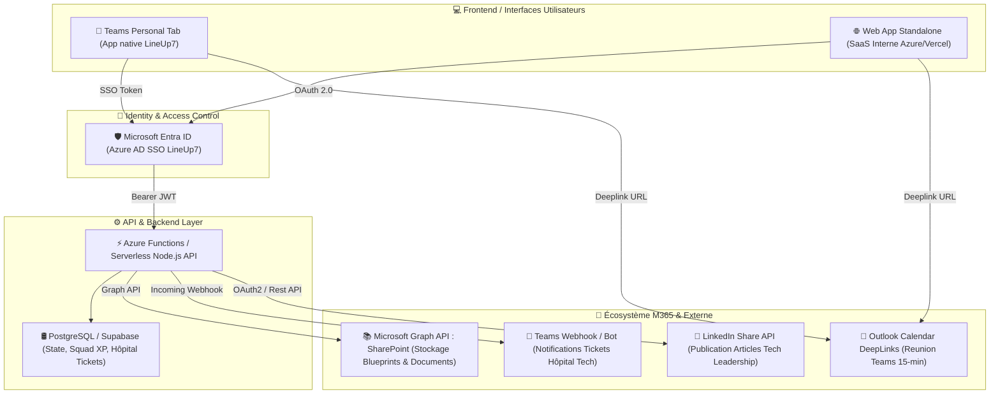
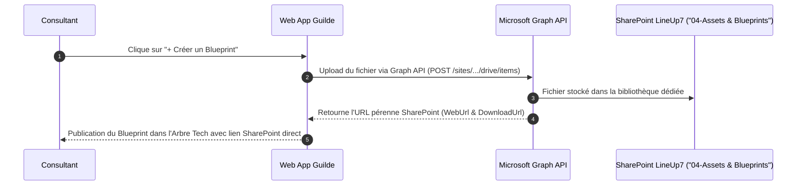
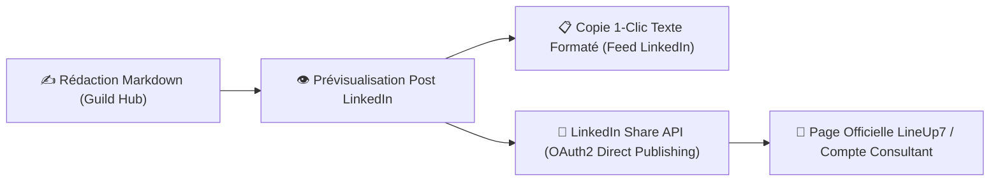

# 🏗️ Architecture Target & Roadmap de Production
## **Hub Guilde d'Expertise LineUp7 (M365, Teams, SharePoint & LinkedIn)**

> **Document d'Architecture Technique (DAT)**  
> **Auteur** : Elian Maufras (Solution Architect & Practice Lead LineUp7) & Antigravity AI  
> **Contexte** : Passage en production ("Live") de l'application Guilde d'Expertise MarTech & Data.

---

## 1. Vue d'Ensemble de l'Architecture cible

---

## 2. Hébergement & Déploiement du Web Front

Pour héberger la Web App avec une intégration transparente dans le quotidien des consultants, **3 options d'hébergement** sont retenues avec une recommandation forte :

### **Option A (Recommandée) : Azure Static Web Apps + Microsoft Teams Personal Tab**
* **Principe** :
  * Le code Frontend (HTML5/JS ES6 ou Vite React) est déployé sur **Azure Static Web Apps** avec un domaine sécurisé (`https://guild.lineup7.fr` ou `https://expert.isoskele.com`).
  * Un fichier `manifest.json` d'application Microsoft Teams est généré pour encapsuler la Web App en **Onglet Personnel Teams** (*Teams Personal Tab*).
* **Avantages** :
  * Le consultant accède à la Guilde **directement depuis son menu de gauche dans Microsoft Teams** sans se reconnecter.
  * Coût quasi nul (Azure Static Web Apps Free/Standard Tier < 10€/mois).
  * SSO automatique via Entra ID (Azure AD) avec le compte M365 du consultant.

### **Option B : SharePoint Framework (SPFx) Web Part**
* **Principe** : Empaqueter l'application sous forme de composant SPFx déployé sur le SharePoint d'entreprise LineUp7.
* **Inconvénient** : Moins souple pour les animations avancées et les mises à jour en direct par rapport à une SWA.

---

## 3. Intégration SharePoint & Stockage des Assets (Blueprints)

Plutôt que d'héberger les fichiers lourd (.pdf, .xlsx, .drawio, .zip) dans la base de données, la Guilde s'appuie sur le **SharePoint d'entreprise M365** via l'API **Microsoft Graph**.

* **Bibliothèque de documents SharePoint dédiée** :  
  `https://isoskele.sharepoint.com/sites/LineUp7-Tech/04-Assets-Blueprints/`
* **Sous-dossiers automatisés** :
  * `/01-SFMC-Core/`
  * `/02-Salesforce-DataCloud/`
  * `/03-Agentforce-MCP/`
  * `/04-Imagino-CDP/`
  * `/05-Modern-DataStack/`

---

## 4. Intégration Microsoft Teams & Hôpital Tech

### **A. Notifications d'Urgence (Teams Incoming Webhooks)**
Lorsqu'un consultant soumet un ticket sur l'Hôpital Tech :
* Un Webhook envoie une carte formatée (**Adaptive Card**) dans le canal Teams officiel **`#tech-hopital-lineup7`** :
  > **🚨 Nouveau cas Hôpital Tech !**  
  > **Sujet** : Timeout Ingestion Data Cloud  
  > **Demandeur** : Yassine.K  
  > **[M'inscrire pour l'aider (1-Clic)]** *(Ouvre la Web App et assigne le Helper)*

### **B. Génération d'Échange Teams 15 min (Outlook Deeplinks)**
Lorsqu'un Helper s'inscrit :
* Un bouton dynamique génère une invitation Outlook/Teams pré-remplie :  
  `https://outlook.office.com/calendar/0/deeplink/compose?subject=Hopital+Tech+-+Déblocage&body=...`

---

## 5. Intégration LinkedIn & Thought Leadership (Export & Publish)

Pour transformer les succès de l'Hôpital Tech et les Blueprints en articles de visibilité externe :

* **Étape 1 (Phase 1 immédiate)** : Bouton **"Copier le post formaté"** pour coller directement sur LinkedIn avec hashtags et structure optimisée.
* **Étape 2 (Phase 2 automatisée)** : Intégration de l'**API LinkedIn Community Management (OAuth 2.0)** avec enregistrement d'une Application LinkedIn Developer `LineUp7 Guild Publisher` pour permettre la publication directe en 1-clic depuis l'application.

---

## 6. Persistance & Sécurité (Back-End Target)

* **Authentification** : Microsoft Entra ID (Azure AD) avec le domaine `@lineup7.fr` / `@isoskele.com`.
* **API Serverless** : Azure Functions (Node.js/TypeScript) exposant les endpoints REST :
  * `GET /api/users` & `PUT /api/users/:id/skills`
  * `GET /api/matrix`
  * `POST /api/hopital/tickets`
  * `GET /api/snippets` & `POST /api/snippets`
  * `GET /api/articles` & `POST /api/articles`
* **Base de données** : Azure Database for PostgreSQL ou Supabase Enterprise (PostgreSQL avec Row Level Security).

---

## 7. Planning & Roadmap de Déploiement en Production

| Phase | Jalons & Livrables | Durée estimée |
| :--- | :--- | :--- |
| **Phase 1 (Actuelle)** | **Prototype Frontend autonome complet** (7 onglets, LocalStorage, CSS Slate Navy, SVGs, Modals). | **Réalisé (OK)** |
| **Phase 2 (M365 Integration)** | • Création de l'App Teams Manifest (.zip). • Setup de l'Azure Static Web App avec SSO Entra ID. • Connecteur SharePoint Graph API pour l'upload de Blueprints. | **Semaine 1 - 2** |
| **Phase 3 (Teams Bot & Database)** | • Déploiement de la base PostgreSQL Supabase. • Webhook Incoming sur le canal Teams `#tech-hopital`. | **Semaine 3** |
| **Phase 4 (LinkedIn Automation)** | • Intégration de l'API LinkedIn Share v2. • Dashboard d'impact (vues, partages des posts de la communauté). | **Semaine 4** |

---

## 🎯 Prochaines Actions Recommandées pour Elian
1. **Tester le prototype en interne** auprès de 2 à 3 consultants référents (*Hugo.S, Yassine.K, Lucas.A*) pour recueillir leurs premiers retours.
2. **Valider la création de l'App Teams** auprès du service IT / DSI Isoskele pour autoriser l'installation du manifest Teams en onglet personnel.
3. **Créer le canal Teams `#tech-hopital-lineup7`** pour recevoir les notifications automatiques.
